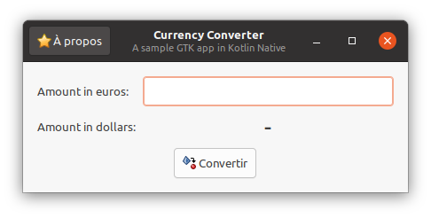
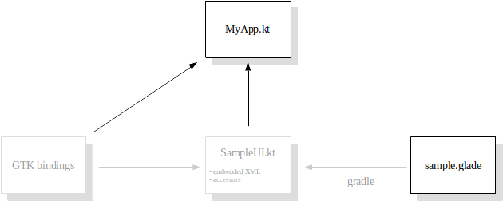

# Kotlin Native GNOME

An API to make **GNOME application** creation easy in **Kotlin Native**, with **Glade** UI integration.



## Features

* a **lightweight GTK object binding**: no wrapper objects, just extension functions & aliases
* a **Glade UI gradle plugin**: produces UI classes for type-safe widget access & glade file integration in the executable
* a sample app

## Current status

Still a *work in progress*. Here is the detail:
* [Glade](https://glade.gnome.org/) gradle plugin: 100% complete
* [GIR](https://gi.readthedocs.io) parsing: 100% complete
* generated API coverage is progressing well. Notable short-comings:
  - some data-types are not handled yet (like GLists and arrays)
  - lambda-based signal handlers don't forward any data
  - methods throwing errors are not handled
  - only generates GTK elements for now (but the parser has been tested with other GIR files)
* packaging:
  - not yet exposed on any Maven repo (Jitpack is not an option due to libgtk absence)
* platform support:
  - Ubuntu 20.04 .. ok
  - other platforms is not enabled yet

## Build

Prerequisites:

```bash
sudo apt install libgtk-3-dev libtinfo5
```

To build & run the sample:

```bash
cd sample
../gradlew runDebugExecutableCommon
```

## Usage

See [sample](sample/src/commonMain/kotlin/org/mrlem/gtk/sample) module.

The objective is to focus on what matters to the app developer: developing  a UI, and easily integrate it into the code.



## See also

Other Kotlin native GTK projects around:
* [kotlin-native-gtk](https://github.com/kropp/kotlin-native-gtk): low-level wrappers bindings, GIR based
* [kotlinx-gtk](https://github.com/Doomsdayrs/kotlinx-gtk): high-level wrappers bindings, manually created
* [gir2java](https://github.com/gstreamer-java/gir2java): GIR file java descriptors generator

For an explanation about why I didn't rely on one of them, see the [FAQ](FAQ.md).
